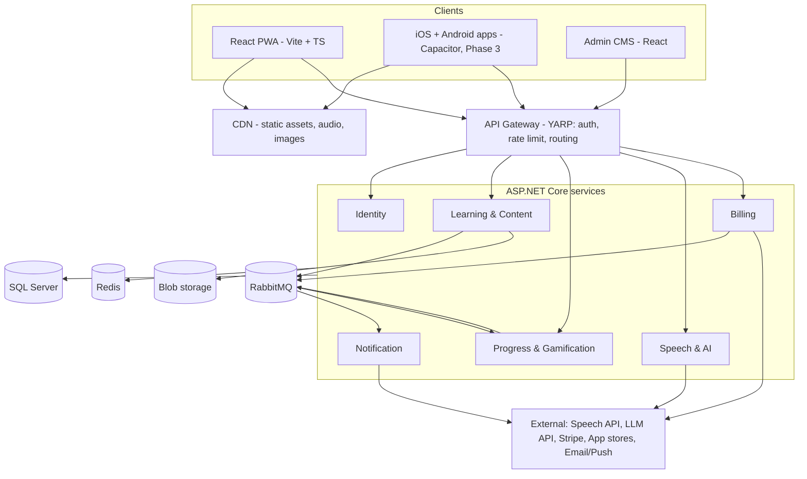

# English Learning Platform — Business Requirements Document

_26 September 2026 · Shamseena_

## 1. Executive summary

We will build a mobile-first English learning platform that teaches learners from zero (Pre-A1) to upper-intermediate (B2) through short, sequenced lessons. It launches as a responsive Progressive Web App (PWA) that looks and behaves like a native app, then ships as iOS and Android apps on the same backend and a shared codebase.

The product combines bite-sized lessons (5–10 minutes), spaced-repetition vocabulary review, speaking practice with pronunciation scoring, and AI-assisted feedback. Gamification (streaks, XP, levels) drives daily habit formation.

| Item | Value |
| --- | --- |
| Document | Business Requirements Document (BRD) |
| Version | 0.1 — Draft for review |
| Product working name | EnglishPath (placeholder) |
| Prepared by | Solution Architecture |
| Target MVP launch | ~6 months from project kickoff |
| Primary markets | Middle East & South Asia (English as a second language), then global |

**Version history**

| Version | Change |
| --- | --- |
| 0.1 | Initial draft: scope, requirements, target architecture |

## 2. Business context & objectives

**Problem.** Adult and teenage learners want practical English for work, study and travel, but existing options are either expensive (tutors, institutes), unstructured (YouTube, random apps), or weak on speaking practice. Most learners study on their phones in short sessions.

**Opportunity.** A structured, CEFR-aligned path delivered in short mobile sessions, with speaking feedback that previously required a human tutor, at a fraction of the cost.

**Business objectives**

1. Launch a usable MVP web app (PWA) within 6 months.
2. Reach 10,000 registered learners within 6 months of launch.
3. Achieve Day-30 retention of at least 20%.
4. Convert 3–5% of active learners to a paid plan by month 12.
5. Release native iOS/Android apps within 12 months, reusing the web codebase (~90%+ of code) and the same backend.

**Success metrics (KPIs)**

| KPI | Target (12 months) | Measured by |
| --- | --- | --- |
| Registered users | 50,000 | Identity service |
| Daily active / monthly active (DAU/MAU) | ≥ 25% | Analytics |
| Day-1 / Day-7 / Day-30 retention | 45% / 30% / 20% | Cohort analytics |
| Avg. lessons completed per active user per week | ≥ 5 | Learning events |
| Placement-to-first-lesson conversion | ≥ 70% | Funnel analytics |
| Free-to-paid conversion | 3–5% | Billing service |
| Level progression (one CEFR sub-level) | within 8–10 weeks of regular use | Assessment results |
| App performance (Lighthouse mobile) | ≥ 90 | CI pipeline |

## 3. Scope & phased roadmap

The platform is delivered in four phases; each phase ships to real users and must meet its exit gate before the next begins.

| Phase | Timeline | Platform | Key scope | Exit gate |
| --- | --- | --- | --- | --- |
| 1. MVP | Months 0–6 | Responsive PWA (installable, app-like) | Sign-up, placement test, A1–A2 lessons, vocab SRS, streaks/XP, progress dashboard, admin CMS | 1,000 active learners; Day-7 retention ≥ 25%; no Sev-1 bugs for 30 days |
| 2. Engagement | Months 6–9 | PWA | Speaking practice + pronunciation scoring, AI writing feedback, B1 content, leaderboards, push notifications, freemium billing | Paid conversion ≥ 2%; speaking used by ≥ 40% of actives |
| 3. Mobile apps | Months 9–12 | iOS + Android (Capacitor, same codebase) | Feature parity with PWA, offline lesson packs, native push, in-app purchases | App-store approval; crash-free sessions ≥ 99.5% |
| 4. Scale | Months 12+ | All | B2 content, AI conversation tutor, live tutor marketplace, B2B/school accounts, multi-language UI | Business case approved per feature |

**In scope (MVP)**

- Learner registration and profile (email, Google, Apple sign-in)
- Adaptive placement test mapping learners to a CEFR level
- Structured course path: Levels → Units → Lessons → Exercises
- Exercise types: multiple choice, fill-in-the-blank, match pairs, reorder words, listening, dictation
- Vocabulary review with spaced repetition
- Gamification: XP, daily goals, streaks, badges
- Progress dashboard and lesson history
- Admin content management system (CMS) for lessons and media
- Installable PWA with offline access to the current unit

**Out of scope (MVP)**

- Native mobile apps (Phase 3)
- Live human tutoring and video classes (Phase 4)
- Social features beyond leaderboards (chat, friends)
- Teaching languages other than English
- Institutional/B2B licensing (Phase 4)

## 4. Stakeholders & personas

**Stakeholders**

| Stakeholder | Role | Key interest |
| --- | --- | --- |
| Product owner / sponsor | Funds and prioritises the roadmap | Growth, retention, revenue |
| Learners | Primary users | Fast, measurable progress; fun; low cost |
| Content team (teachers, linguists) | Author and review lessons in the CMS | Easy authoring, CEFR alignment, quality control |
| Admin / support | Manage users, refunds, reports | User lookup, audit trail |
| Engineering & DevOps | Build and run the platform | Maintainable architecture, observability |
| Marketing | Acquisition and campaigns | Referral links, analytics, SEO landing pages |

**Learner personas**

| Persona | Profile | Goal | Needs from the product |
| --- | --- | --- | --- |
| Aisha, 24 — job seeker | Graduate, A2 level, studies on the metro | Pass interviews in English | Business vocabulary, speaking confidence, 10-minute sessions |
| Ravi, 35 — working professional | Retail supervisor, B1, busy shifts | Communicate with customers and managers | Workplace dialogues, pronunciation, flexible schedule |
| Maryam, 16 — school student | A2–B1, exam-focused | Improve grades and IELTS readiness later | Grammar clarity, gamified practice, parental visibility |
| Joseph, 50 — beginner | Pre-A1, low digital confidence | Everyday survival English | Very simple UI, audio-first, native-language hints |

## 5. Functional requirements

Requirements are grouped by module and prioritised with MoSCoW (Must / Should / Could). Phase refers to the roadmap in section 3.

### 5.1 Identity & onboarding

| ID | Requirement | Priority | Phase |
| --- | --- | --- | --- |
| FR-01 | Register/login with email + password, Google and Apple sign-in | Must | 1 |
| FR-02 | Onboarding flow: goal (work, travel, study, exam), daily time target (5/10/15/20 min), native language | Must | 1 |
| FR-03 | Guest mode: try 1 lesson before sign-up, progress carried over | Should | 1 |
| FR-04 | Password reset, email verification, account deletion (self-service) | Must | 1 |
| FR-05 | Parent/guardian consent flow for users under 18 | Must | 1 |

### 5.2 Placement & assessment

| ID | Requirement | Priority | Phase |
| --- | --- | --- | --- |
| FR-10 | Adaptive placement test (≤ 15 min) covering grammar, vocabulary, reading, listening; outputs CEFR level | Must | 1 |
| FR-11 | Option to skip placement and start from Pre-A1 | Must | 1 |
| FR-12 | End-of-unit checkpoint quiz; pass mark 70% to unlock next unit | Must | 1 |
| FR-13 | Level-completion test with shareable certificate (PDF) | Should | 2 |

### 5.3 Learning path & lessons

| ID | Requirement | Priority | Phase |
| --- | --- | --- | --- |
| FR-20 | Visual course map: Levels → Units → Lessons, with locked/unlocked/completed states | Must | 1 |
| FR-21 | Lesson player: intro (concept + example), 8–15 exercises, summary screen | Must | 1 |
| FR-22 | Exercise types: multiple choice, fill-blank, match pairs, reorder words, listen-and-select, dictation, image-word | Must | 1 |
| FR-23 | Immediate feedback per answer with correct answer and short explanation | Must | 1 |
| FR-24 | Hearts/lives or mistake-review: wrong answers repeated at lesson end | Should | 1 |
| FR-25 | Grammar tips library searchable by topic | Should | 1 |
| FR-26 | Native-language hints (Arabic, Hindi, Urdu, Malayalam first) toggle | Should | 2 |
| FR-27 | Resume lesson exactly where the learner left off, across devices | Must | 1 |

### 5.4 Vocabulary & review

| ID | Requirement | Priority | Phase |
| --- | --- | --- | --- |
| FR-30 | Personal word bank auto-populated from completed lessons | Must | 1 |
| FR-31 | Spaced-repetition review (SM-2 or FSRS algorithm) with daily due count | Must | 1 |
| FR-32 | Word card: audio (UK/US), IPA, example sentence, image, translation | Must | 1 |

### 5.5 Speaking, listening & writing

| ID | Requirement | Priority | Phase |
| --- | --- | --- | --- |
| FR-40 | Record-and-compare speaking exercises with pronunciation score per word | Must | 2 |
| FR-41 | Shadowing exercises: play native audio, learner repeats | Should | 2 |
| FR-42 | AI feedback on short written answers (grammar, vocabulary, suggested rewrite) | Should | 2 |
| FR-43 | AI role-play conversation tutor with scenario scripts (interview, café, doctor) | Could | 4 |

### 5.6 Gamification & engagement

| ID | Requirement | Priority | Phase |
| --- | --- | --- | --- |
| FR-50 | XP per exercise/lesson, daily XP goal, streak counter with streak-freeze | Must | 1 |
| FR-51 | Badges/achievements for milestones | Should | 1 |
| FR-52 | Weekly leagues/leaderboards | Should | 2 |
| FR-53 | Reminders: email + web push (PWA), native push (Phase 3) at user-chosen time | Must | 2 |

### 5.7 Progress & reporting

| ID | Requirement | Priority | Phase |
| --- | --- | --- | --- |
| FR-60 | Learner dashboard: streak, XP, lessons done, words learned, skill radar (reading, listening, speaking, writing, grammar, vocab) | Must | 1 |
| FR-61 | Weekly progress email | Should | 2 |

### 5.8 Subscription & payments

| ID | Requirement | Priority | Phase |
| --- | --- | --- | --- |
| FR-70 | Freemium: free core lessons with limits; Premium unlocks speaking, AI feedback, unlimited review, offline packs | Must | 2 |
| FR-71 | Monthly/annual plans via Stripe (web) and App Store / Google Play billing (mobile) | Must | 2–3 |
| FR-72 | Entitlements synced across web and mobile for the same account | Must | 3 |
| FR-73 | Promo codes and free trial (7 days) | Should | 2 |

### 5.9 Content management (admin)

| ID | Requirement | Priority | Phase |
| --- | --- | --- | --- |
| FR-80 | CMS to create/edit levels, units, lessons, exercises with live preview | Must | 1 |
| FR-81 | Media upload (audio, images) with automatic compression and CDN delivery | Must | 1 |
| FR-82 | Draft → Review → Published workflow with versioning and rollback | Must | 1 |
| FR-83 | Text-to-speech generation for exercise audio (neural voices, UK/US) | Should | 1 |
| FR-84 | AI-assisted exercise drafting (content author reviews before publish) | Could | 2 |
| FR-85 | Bulk import/export of content (CSV/JSON) | Should | 1 |

### 5.10 Administration & support

| ID | Requirement | Priority | Phase |
| --- | --- | --- | --- |
| FR-90 | User search, view progress, reset streak, manage subscription | Must | 1 |
| FR-91 | Role-based access: Super Admin, Content Author, Reviewer, Support | Must | 1 |
| FR-92 | Audit log of admin actions | Must | 1 |
| FR-93 | In-app feedback / report-a-problem on any exercise | Should | 1 |

## 6. Curriculum & content model

The curriculum follows the Common European Framework of Reference (CEFR), so learner progress maps to an internationally recognised scale. MVP covers Pre-A1 to A2; B1 arrives in Phase 2 and B2 in Phase 4.

| Level | Learner can… | Units (approx.) | Lessons (approx.) |
| --- | --- | --- | --- |
| Pre-A1 Starter | Recognise alphabet, numbers, greetings | 5 | 40 |
| A1 Beginner | Introduce self, simple questions, daily routines | 12 | 120 |
| A2 Elementary | Shopping, directions, past events, simple emails | 12 | 120 |
| B1 Intermediate | Work conversations, opinions, stories, plans | 14 | 150 |
| B2 Upper-intermediate | Meetings, arguments, formal writing, nuance | 14 | 150 |

**Content hierarchy**

1. **Course** — e.g. General English, Business English (Phase 4)
2. **Level** — CEFR band
3. **Unit** — a theme (e.g. "At work") with can-do objectives and a checkpoint quiz
4. **Lesson** — 5–10 minutes, one focus (grammar point, vocabulary set, or skill)
5. **Exercise** — typed item with prompt, media, answer key, explanation, skill tags

**Lesson design rules**

- Every lesson declares a can-do objective, target vocabulary (≤ 10 new words) and a grammar point.
- New vocabulary reappears in at least 3 later lessons and enters the learner's review queue.
- Every unit mixes all four skills; each lesson includes at least one listening item.
- Content is authored as structured JSON (not free-form HTML) so web and mobile render it natively.

**Core data entities:** User, LearnerProfile, Course, Level, Unit, Lesson, Exercise, MediaAsset, Attempt, LessonProgress, VocabularyItem, ReviewCard, Achievement, Subscription, Payment, Notification, AuditLog.

## 7. Non-functional requirements

| ID | Category | Requirement |
| --- | --- | --- |
| NFR-01 | Performance | First load ≤ 2.5 s LCP on a mid-range Android over 4G; subsequent screens ≤ 300 ms; API p95 ≤ 250 ms |
| NFR-02 | Performance | Initial JS bundle ≤ 200 KB gzipped; lessons prefetched one ahead |
| NFR-03 | Scalability | 50,000 concurrent users at Phase 3 via horizontal scaling of stateless services |
| NFR-04 | Availability | 99.9% monthly uptime for learner-facing APIs; RPO ≤ 15 min, RTO ≤ 1 h |
| NFR-05 | Offline | PWA caches app shell + current unit; answers queued offline and synced on reconnect |
| NFR-06 | Security | OAuth 2.0 / OpenID Connect; JWT access tokens (15 min) + rotating refresh tokens; OWASP ASVS Level 2 |
| NFR-07 | Security | TLS 1.2+ everywhere; encryption at rest for databases and blob storage; secrets in a vault |
| NFR-08 | Privacy | GDPR and UAE PDPL alignment: consent, data export, right to erasure within 30 days |
| NFR-09 | Accessibility | WCAG 2.2 AA: screen-reader labels, captions/transcripts for audio, 4.5:1 contrast, 44 px touch targets |
| NFR-10 | Compatibility | Last 2 versions of Chrome, Safari (iOS 16+), Edge, Firefox, Samsung Internet; 320–1440 px widths |
| NFR-11 | Localisation | UI strings externalised (i18n); RTL-ready layout for Arabic UI |
| NFR-12 | Observability | Centralised logs, distributed tracing, metrics dashboards, alerting on error rate and latency |
| NFR-13 | Maintainability | ≥ 70% unit-test coverage on domain logic; automated CI/CD; infrastructure as code |
| NFR-14 | Audio | Speech recording latency ≤ 1.5 s to score; audio assets delivered via CDN in AAC/Opus |

## 8. Solution architecture

The recommended architecture is a React PWA that is later packaged as iOS and Android apps with Capacitor, sharing one codebase and TypeScript domain layer, talking to ASP.NET Core services behind an API gateway, with event-driven integration over RabbitMQ. The six services below are bounded contexts; for MVP they can run as fewer deployables and be split further as load and team size grow.

### 8.1 Technology stack

| Layer | Choice | Rationale |
| --- | --- | --- |
| Web frontend | React 18 + Vite + TypeScript, Tailwind CSS, TanStack Query, Zustand, React Router | Fast builds, small bundles, strong typing |
| App-like PWA | vite-plugin-pwa (Workbox), Web App Manifest, IndexedDB (Dexie) for offline queue | Installable, offline, push on Android + iOS 16.4+ |
| Animations & UX | Framer Motion, Lottie for celebrations | Native-app feel (page transitions, haptic-like feedback) |
| Mobile (Phase 3) | Capacitor wrapping the same React/Vite build; plugins for push (FCM/APNs), in-app purchase (RevenueCat), microphone, haptics, SQLite; shared `packages/core` TS library (API client, models, validation, SRS logic) | Reuse ~90–95% of code including UI; one team, one release pipeline |
| Monorepo | Nx or Turborepo with pnpm workspaces | Shared packages across web, mobile, CMS |
| Backend | ASP.NET Core 8/9 Web APIs, Clean Architecture + CQRS (MediatR) | Team strength, performance, mature tooling |
| API gateway | YARP | .NET-native routing, auth, rate limiting |
| Messaging | RabbitMQ with MassTransit (outbox pattern) | Reliable domain events between services |
| Database | SQL Server (database per service), EF Core | Relational integrity for progress and billing |
| Cache | Redis: sessions, leaderboards (sorted sets), lesson cache, rate limits | Low-latency reads, real-time rankings |
| Storage & CDN | Azure Blob Storage + Azure Front Door (or S3 + CloudFront) | Cheap media hosting, global delivery |
| Speech | Azure AI Speech (pronunciation assessment + neural TTS) | Word/phoneme-level scoring out of the box |
| AI feedback | LLM API (Azure OpenAI or Claude) behind an internal AI service with prompt templates and cost caps | Swappable provider, guarded usage |
| Auth | ASP.NET Core Identity + Duende IdentityServer or OpenIddict; social logins | OIDC standard for web and mobile |
| Payments | Stripe (web); RevenueCat for App Store / Play entitlements | Unified entitlements across platforms |
| Notifications | Web Push (VAPID), Firebase Cloud Messaging / APNs, SendGrid email | All channels from one service |
| Hosting | Docker containers on Azure Container Apps (MVP) → AKS at scale | Low ops at start, path to Kubernetes |
| DevOps | GitHub Actions, Bicep/Terraform, blue-green deploys | Repeatable, automated releases |
| Observability | OpenTelemetry → Application Insights / Grafana; Serilog | Tracing across services |
| Analytics | PostHog or Mixpanel (product events); Sentry (errors) | Funnels, retention cohorts, crash reports |

### 8.2 Service responsibilities

| Service | Owns | Key events published |
| --- | --- | --- |
| Identity | Users, credentials, roles, consent | UserRegistered, UserDeleted |
| Learning & Content | Courses, lessons, exercises, media, CMS workflow, placement test | LessonPublished, LessonCompleted, PlacementCompleted |
| Progress & Gamification | XP, streaks, badges, SRS review cards, leaderboards, dashboard | StreakBroken, LevelUp, AchievementUnlocked |
| Speech & AI | Pronunciation scoring, writing feedback, TTS jobs, AI usage limits | SpeechScored, FeedbackGenerated |
| Billing | Plans, subscriptions, entitlements, webhooks from Stripe/RevenueCat | SubscriptionActivated, SubscriptionCancelled |
| Notification | Reminders, emails, push, preferences | — (consumer only) |

### 8.3 Key design decisions

1. **Web first, app later — one codebase.** Launch as a React + Vite + TypeScript PWA, then ship the same app to the App Store and Google Play with **Capacitor**, which wraps the web build in a native shell and exposes native APIs (push, in-app purchase, microphone, haptics, local storage) through plugins. This reuses ~90–95% of the code, keeps one team on one stack, and turns Phase 3 into packaging and native polish rather than a rewrite. React Native (Expo) stays the fallback if device testing shows the web view can't meet the native-feel bar; the shared `packages/core` layer keeps that switch cheap. Flutter and .NET MAUI are ruled out because they mean a second UI codebase in a new language.
2. **Content as structured JSON.** Exercises are stored as typed JSON schemas and rendered by client components, so the same content works on web, mobile and offline.
3. **Offline-first learning loop.** The client downloads a lesson bundle, scores answers locally, and syncs attempts in batches; the server re-validates and awards XP (server is the source of truth to prevent cheating).
4. **Event-driven progress.** LessonCompleted events update XP, streaks, review queues and notifications asynchronously, keeping the lesson API fast.
5. **Provider abstraction for AI and speech.** External AI calls go through the Speech & AI service with per-user quotas, caching, and fallbacks, so providers and costs can be changed without client releases.
6. **Mobile-ready APIs from day one.** Versioned REST APIs (`/api/v1`), OpenAPI contracts, generated TypeScript clients, and token-based auth that works identically for web and mobile.

### 8.4 Environments

Local (Docker Compose) → Dev → QA/Staging (production-like, anonymised data) → Production. Each environment is provisioned by infrastructure-as-code; database migrations run in the pipeline.

## 9. Mobile-first UX principles

The web app must feel indistinguishable from a native app on a phone, while still working well on tablets and desktops.

- **Layout:** designed at 375 px first; bottom tab bar on mobile (Learn, Review, Speak, Leaderboard, Profile) that becomes a left sidebar on ≥ 1024 px; lesson player is a centred 480 px column on desktop.
- **App shell:** standalone display mode (no browser bar), splash screen, themed status bar, safe-area insets for notched phones.
- **Interactions:** swipe and tap gestures, 44 px minimum touch targets, instant visual feedback, page transitions, skeleton loaders instead of spinners.
- **Feedback & delight:** sound + vibration (Vibration API) on correct/wrong answers, celebration animations on lesson and streak milestones.
- **One task per screen:** a single exercise per screen with a sticky "Check" button in the thumb zone.
- **Audio-first:** every word and sentence playable; slow-playback toggle; auto-play configurable.
- **Themes:** light and dark mode; large-text setting; RTL mirroring for Arabic UI.
- **Design system:** shared tokens (colour, spacing, typography) defined once in Tailwind and shared by the web and app builds, so both look identical.

**Primary learner journey:** Open app → daily goal ring → continue next lesson → 8–15 exercises → summary (XP, words learned) → review due words → streak confirmed → reminder scheduled for tomorrow.

## 10. Monetisation, analytics & compliance

**Monetisation model: freemium subscription.**

| Plan | Includes | Indicative price |
| --- | --- | --- |
| Free | Core lessons, 1 review session/day, ads-free, limited hearts | AED 0 |
| Premium | Unlimited lessons and review, speaking + pronunciation scoring, AI writing feedback, offline packs, certificates | ~AED 29/month or ~AED 199/year |
| Family / School (Phase 4) | Multiple seats, teacher dashboard, reporting | Quoted |

Prices are placeholders for validation through pricing experiments; regional pricing (e.g. lower in South Asia) is expected.

**Analytics events (minimum set):** sign_up, onboarding_completed, placement_completed, lesson_started, lesson_completed, exercise_answered (correct/incorrect, time taken), review_completed, streak_extended, streak_broken, paywall_viewed, trial_started, subscription_purchased, notification_opened, app_installed (PWA).

**Compliance**

- UAE Personal Data Protection Law (PDPL) and GDPR for EU users; data residency in a UAE or EU region.
- Children: verifiable parental consent for under-18s; no behavioural ads; COPPA considerations if US users under 13 are allowed (recommended: minimum age 13).
- Voice recordings: explicit consent, used only for scoring, deleted after 30 days unless the learner opts in to keep them.
- AI: disclosed to users; outputs filtered for safety; no learner data used to train third-party models.
- Payments: PCI DSS scope minimised by using Stripe-hosted checkout and store billing.
- App store policies: digital subscriptions sold inside mobile apps must use in-app purchase.

## 11. Assumptions, constraints, risks & dependencies

**Assumptions**

- Learners primarily use Android phones; iOS share is 30–40% in target markets.
- A content team of 2–3 ESL teachers is available from month 1 to author ~160 MVP lessons.
- Cloud hosting is Microsoft Azure (UAE North region) to match the .NET stack; AWS is an acceptable alternative.
- UI language at launch is English only, with native-language hints added in Phase 2.

**Constraints**

- MVP budget and timeline: ~6 months with a core team of 5–7 (see section 12).
- iOS PWA limitations: push only on iOS 16.4+ and only once installed to the home screen; background sync is unavailable.
- App-store commission (15–30%) applies to mobile subscriptions.

**Risks**

| Risk | Impact | Likelihood | Mitigation |
| --- | --- | --- | --- |
| Content production is slower than engineering | High | High | Start content in month 1; AI-assisted drafting; reusable exercise templates |
| Low retention after week 1 | High | Medium | Streaks, reminders, short lessons; A/B test onboarding; track cohorts weekly |
| AI/speech API costs grow with usage | Medium | Medium | Premium-only access, per-user quotas, caching of TTS audio, provider abstraction |
| Pronunciation scoring inaccurate for regional accents | Medium | Medium | Test with target-market speakers; show feedback as guidance, not pass/fail |
| PWA feels less native on iOS | Medium | Medium | Careful iOS testing; accelerate Phase 3 if iOS share is high |
| Microservices overhead slows MVP | Medium | Medium | Fewer deployables at MVP; shared CI templates; split later |
| Data-privacy breach | High | Low | Encryption, least privilege, pen test before launch, incident response plan |
| Competition from established apps | High | High | Differentiate on regional relevance, native-language support, work-focused English |

**Dependencies**

- Azure AI Speech (or equivalent) for pronunciation assessment and TTS
- LLM provider for writing feedback and conversation tutor
- Stripe, Apple App Store, Google Play, RevenueCat for billing
- SendGrid (email), Firebase Cloud Messaging / APNs (push)
- Licensed or original imagery and audio for lessons

## 12. Delivery plan & MVP acceptance

**MVP team (indicative):** 1 product owner, 1 solution architect/tech lead, 2 full-stack .NET + React developers, 1 frontend/PWA developer, 1 QA engineer, 1 UI/UX designer (part-time), 2–3 ESL content authors, DevOps shared.

| Sprint window (2-week sprints) | Deliverables |
| --- | --- |
| Month 1 | Discovery, UX prototypes, design system, architecture spikes, CI/CD, monorepo, identity service; content framework and first unit drafted |
| Months 2–3 | Learning & Content service, CMS, lesson player with 7 exercise types, placement test, PWA shell and offline caching |
| Month 4 | Progress & Gamification (XP, streaks, badges), SRS review, dashboard, notifications (email) |
| Month 5 | Content load (Pre-A1–A2), performance and accessibility hardening, security review, analytics |
| Month 6 | Closed beta (200–500 learners), bug fixing, pen test, public launch |

**MVP acceptance criteria**

- [ ] A new learner can sign up, take the placement test and complete a first lesson in under 15 minutes.
- [ ] At least 160 lessons (Pre-A1 to A2) are published through the CMS review workflow.
- [ ] All 7 MVP exercise types work on the supported browsers at 320–1440 px widths.
- [ ] PWA installs on Android and iOS, launches standalone, and completes a cached lesson offline, syncing on reconnect.
- [ ] XP, streaks and review queues update correctly across two devices for the same account.
- [ ] Lighthouse mobile scores ≥ 90 for performance, accessibility and best practices.
- [ ] No open critical/high findings from the security review and penetration test.
- [ ] Analytics funnel from sign_up to lesson_completed is visible on the dashboard.

**Open questions**

- Final product name and brand identity?
- Hosting choice confirmed: Azure (UAE North) or AWS (me-central-1)?
- Which native languages to support for hints first?
- Free tier limits: hearts-based or daily-lesson cap?
- Target minimum age: 13+ or allow younger learners with parental accounts?

**Glossary**

| Term | Meaning |
| --- | --- |
| BRD | Business Requirements Document |
| CEFR | Common European Framework of Reference for Languages (A1–C2) |
| PWA | Progressive Web App: a website installable and usable like a native app |
| SRS | Spaced Repetition System: reviews items at growing intervals to aid memory |
| XP | Experience points awarded for learning activity |
| MoSCoW | Prioritisation: Must, Should, Could, Won't |
| CQRS | Command Query Responsibility Segregation |
| RPO / RTO | Recovery Point / Recovery Time Objective |
