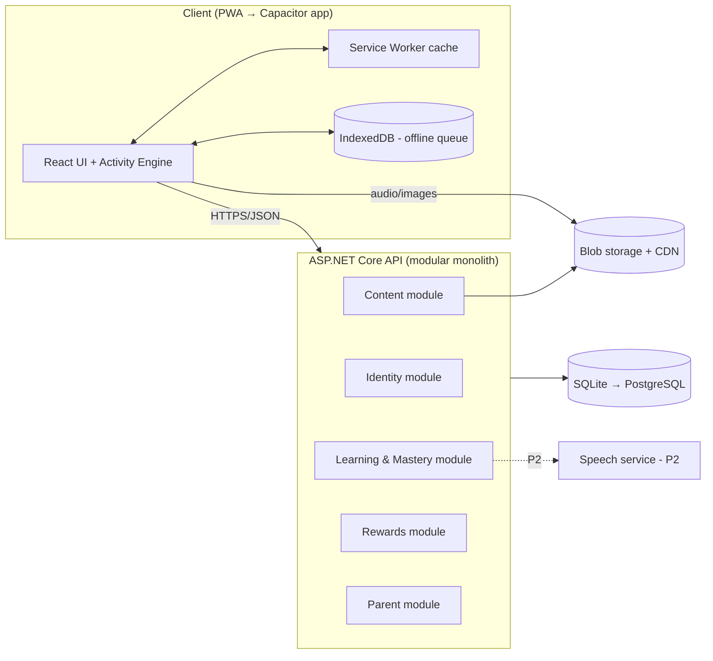
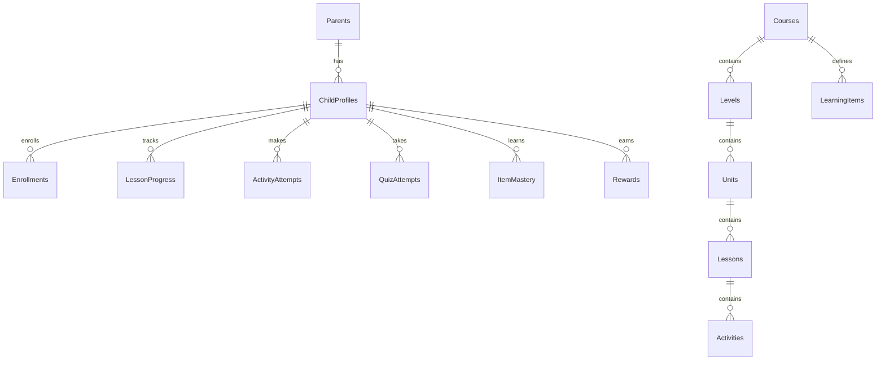

# KidsLang — Business Requirements Document (BRD)

Product: Interactive language-learning app for children (Arabic & Hindi)
Version: 1.0 (Draft)
Date: 26 September 2026
Owner: Shamseena
Delivery path: Mobile-style responsive web app (PWA) → native mobile apps (iOS/Android)
Database path: SQLite (development/MVP) → PostgreSQL (production)

## 1. Vision

A playful, safe, ad-free app where children learn Arabic and Hindi from the very first letter, one small step at a time. Every step teaches, lets the child play with what they learned, and checks mastery before the next step unlocks, so no child moves ahead with gaps.

### 1.1 Problem

- Most kids' language apps are either passive (videos) or game-heavy with little real learning.
- Children skip ahead and forget foundations (letters, sounds, vowel marks), which breaks reading later.
- Arabic (right-to-left, letters change shape by position) and Hindi (Devanagari with matras) need script-specific teaching that generic apps handle poorly.

### 1.2 Solution

- Structured curriculum: Language → Level → Unit → Lesson → Activity.
- Each lesson follows Learn → Play → Check, with a mastery gate.
- Rich interaction: audio from native speakers, letter tracing, drag-and-drop, matching, sound games, stickers and rewards.
- Spaced review brings back older items so learning sticks.

## 2. Goals & Success Metrics

| Goal | Metric | MVP Target |
|---|---|---|
| Kids actually learn | Mastery-check pass rate on first or second attempt | ≥ 75% |
| Learning sticks | Correct rate on spaced-review items after 7 days | ≥ 70% |
| Kids enjoy it | Avg. session length (ages 4–8) | 8–15 min |
| Habit | Day-7 retention of active child profiles | ≥ 35% |
| Parents trust it | Parent satisfaction (in-app survey) | ≥ 4.3 / 5 |
| Performance | First load on mid-range phone (4G) | < 3 s; lesson start < 1 s |

## 3. Users & Personas

| Persona | Description | Needs |
|---|---|---|
| Child learner (4–6) | Pre-reader, taps and drags, short attention span | Audio-first, big targets, no reading required, instant positive feedback |
| Child learner (7–10) | Early reader | More challenge, streaks, word/sentence building |
| Parent / guardian | Creates account, manages child profiles | Progress visibility, screen-time controls, safety, no ads |
| Content admin (internal) | Authors lessons and media | Content tooling, preview, versioning |
| (Later) Teacher | Classroom use | Class groups, assignments, reports |

## 4. Scope

### 4.1 MVP (Phase 1)

- Responsive, mobile-look web app (installable PWA), portrait-first.
- Parent account + up to 4 child profiles (avatar + optional picture-PIN).
- Two courses: Arabic Level 1 and Hindi Level 1 (letters/sounds foundation).
- 8 core activity types (see §6).
- Mastery gating, stars, stickers, daily streak.
- Spaced review ("Practice Garden").
- Parent dashboard (progress per child, time spent, weak items).
- Offline play for downloaded lessons; progress syncs later.
- SQLite database.

### 4.2 Phase 2

- Levels 2–3 (vowel marks/matras, words, simple sentences).
- Speech practice (child says the word; pronunciation feedback).
- Content admin panel.
- PostgreSQL + cloud deployment.

### 4.3 Phase 3

- Native iOS/Android apps (Capacitor wrap of the same codebase).
- Subscriptions / in-app purchase.
- Teacher/classroom mode.
- Additional languages (architecture supports N languages from day one).

### 4.4 Out of scope (MVP)

Chat between users, public leaderboards, user-generated content, ads.

## 5. Learning Design

### 5.1 Content hierarchy

```
Course (e.g., Arabic)
 └── Level (e.g., Level 1: Letters & Sounds)
      └── Unit (e.g., Unit 2: ب ت ث)
           └── Lesson (e.g., Lesson 2.1: Letter ب)
                └── Activities (Learn → Play → Check)
```

Each lesson teaches one small concept (typically one letter or 3–5 new words) and takes 5–8 minutes.

### 5.2 Lesson flow

1. **Learn (Introduce)** — Animated character presents the item: sound, shape, example word with picture. Tap to replay audio.
2. **Play (Practice)** — 3–5 activities using the new item plus 1–2 earlier items. Hints are unlimited; mistakes are gentle ("Try again!").
3. **Check (Mastery Quiz)** — 5–8 short items with no hints on the first try. Determines whether the next lesson unlocks.
4. **Reward** — Stars (1–3), sticker, character celebration.

### 5.3 Arabic Level 1–3 outline

| Level | Units | Content |
|---|---|---|
| 1. Letters & Sounds | 1–8 | 28 letters grouped by shape family (ب ت ث / ج ح خ / د ذ / ر ز / س ش / ص ض / ط ظ / ع غ / ف ق / ك ل م ن / ه و ي, plus ا). Sound, name, isolated shape, tracing |
| 2. Letter Forms & Harakat | 9–14 | Initial/medial/final forms, joining letters; short vowels (fatha, kasra, damma), sukoon, shadda, tanween; long vowels (ا و ي) |
| 3. First Words | 15–20 | 2–3 letter words, colors, numbers ١–١٠, animals, family, greetings, simple sentences |

Script requirements: full RTL layout in Arabic lessons, Arabic kid-friendly font, correct letter joining (never render isolated glyphs where joined forms are expected).

### 5.4 Hindi Level 1–3 outline

| Level | Units | Content |
|---|---|---|
| 1. Swar & Vyanjan | 1–8 | Vowels अ आ इ ई उ ऊ ऋ ए ऐ ओ औ अं अः; consonants by varga (क-वर्ग, च-वर्ग, ट-वर्ग, त-वर्ग, प-वर्ग), then य र ल व श ष स ह, and क्ष त्र ज्ञ श्र |
| 2. Matras & Joining | 9–14 | All matras (ा ि ी ु ू ृ े ै ो ौ ं ः), barakhadi (क का कि की…), simple conjuncts |
| 3. First Words | 15–20 | Two/three-letter words without matras (जल, घर, कमल), then with matras; colors, numbers १–१०, animals, family, greetings, simple sentences |

Script requirements: correct Devanagari shaping (shirorekha line, matra placement), Devanagari kid-friendly font.

### 5.5 Mastery & progression rules

A lesson is mastered when all conditions are met:

| Rule | Default |
|---|---|
| Mastery quiz score | ≥ 80% |
| Every new item in the lesson answered correctly at least once in the quiz | Required |
| Tracing activities (where present) | Stroke accuracy ≥ 70% |

Behaviour:

- Pass → next lesson unlocks; stars awarded (80–89% = 1★, 90–99% = 2★, 100% = 3★).
- Fail → no "you failed" message. The child goes to a short Help Loop: re-teach the missed items → 2–3 targeted practice activities → retry the quiz (with a different question mix).
- Unit Checkpoint at the end of each unit: mixed quiz over all unit items; must pass to unlock the next unit.
- Level Test at the end of each level; unlocks the next level and awards a trophy.
- Thresholds are configurable per lesson in content data.
- Parents may override-unlock a lesson from the parent dashboard (behind parent gate).

### 5.6 Spaced review ("Practice Garden")

- Every learned item (letter, word) gets a Leitner box (1–5).
- Correct answer → box +1; wrong → box 1.
- Review intervals: 1, 2, 4, 7, 14 days.
- Each day the app offers a 3-minute review with due items; completing it waters the child's garden (visual reward).
- Items consistently wrong are flagged as weak items on the parent dashboard.

### 5.7 Pedagogy principles

- Audio-first: every instruction is spoken; no reading needed for ages 4–6.
- One new idea at a time; mix in 20–30% older items.
- Immediate feedback with sound + animation.
- No punishment, no lives/hearts that block learning.
- Short sessions; a gentle "Great job, time for a break!" after the parent-set limit.

## 6. Activity Types

| # | Activity | Description | Used in |
|---|---|---|---|
| A1 | Listen & Tap | Hear a sound, tap the matching letter/picture among 2–4 options | Play, Check |
| A2 | Trace the Letter | Follow animated stroke guides with finger; stroke-order and accuracy scored | Learn, Play, Check |
| A3 | Match Pairs | Match letter ↔ sound, word ↔ picture (memory-card or line-drawing style) | Play |
| A4 | Drag & Drop | Drag letter to the correct picture/basket, or build a word from letters | Play, Check |
| A5 | Pop the Balloon | Balloons with letters float up; pop the ones matching the spoken sound | Play |
| A6 | Find the Letter | Spot the target letter inside a word or scene (Arabic: in any position form) | Play, Check |
| A7 | Build the Word | Arrange letters/matras/harakat to form a spoken word | Play, Check (L2+) |
| A8 | Story Card | Short animated story using lesson items; tap objects to hear words | Learn |
| A9 (P2) | Say It! | Child speaks the word; speech recognition gives star feedback | Play |
| A10 (P2) | Odd One Out | Pick the item that doesn't belong (sound, shape, category) | Play, Check |

All activities are data-driven: one renderer per type, content supplied as JSON config (see §11.4).

## 7. Gamification & Engagement

- Mascot characters: one per language (e.g., a camel for Arabic, an elephant for Hindi) that guide, cheer, and react.
- Stars per lesson; stickers per unit; trophies per level.
- Sticker Book the child can browse and arrange.
- Daily streak with a friendly "streak freeze" (no guilt mechanics).
- Avatar customization unlocked by stars (hats, colors).
- Journey map: lessons shown as a winding path with locked/unlocked/mastered states.
- Celebrations: confetti, mascot dance, sound effects (respecting mute setting).

## 8. Functional Requirements

### 8.1 Accounts & profiles

| ID | Requirement |
|---|---|
| FR-01 | Parent registers with email + password (or Google sign-in in P2). |
| FR-02 | Parent creates up to 4 child profiles: display name (nickname), age band, avatar, language(s). |
| FR-03 | Child selects their profile by avatar; optional picture-PIN (tap 3 pictures). No child email/password. |
| FR-04 | Parent gate (e.g., "hold for 3 seconds + solve a simple multiplication") protects settings, purchases, external links, and the parent dashboard. |
| FR-05 | Parent can delete a child profile and all its data. |

### 8.2 Learning

| ID | Requirement |
|---|---|
| FR-10 | Child sees a journey map per course with lesson states: locked, available, in progress, mastered. |
| FR-11 | Lessons run Learn → Play → Check in order; child cannot jump to Check without completing Play. |
| FR-12 | Next lesson unlocks only when mastery rules (§5.5) are satisfied. |
| FR-13 | Failed Check triggers the Help Loop with re-teaching and a regenerated quiz. |
| FR-14 | Unit Checkpoints and Level Tests gate progression between units/levels. |
| FR-15 | Every activity item has native-speaker audio; replay is always available. |
| FR-16 | Tracing captures strokes and scores direction, order, and coverage. |
| FR-17 | Spaced-review queue is generated daily per child. |
| FR-18 | Child can resume an interrupted lesson from the last completed activity. |

### 8.3 Rewards

| ID | Requirement |
|---|---|
| FR-20 | Award stars, stickers, trophies per rules in §7. |
| FR-21 | Track daily streak in the child's local time zone. |
| FR-22 | Avatar items unlock by star thresholds. |

### 8.4 Parent dashboard

| ID | Requirement |
|---|---|
| FR-30 | Show per-child progress: lessons mastered, current lesson, stars, streak. |
| FR-31 | Show time spent per day/week. |
| FR-32 | Show weak items with an option to assign extra review. |
| FR-33 | Set daily screen-time limit and quiet hours. |
| FR-34 | Toggle sound, music, and language of UI instructions (English / Arabic / Hindi / Malayalam later). |
| FR-35 | Manual unlock override per lesson. |

### 8.5 Offline & sync

| ID | Requirement |
|---|---|
| FR-40 | App shell and visited lessons are cached for offline use. |
| FR-41 | Parent can "Download Unit" to prefetch lessons and media. |
| FR-42 | Attempts made offline are queued locally and synced when online (idempotent by client-generated attempt ID). |

### 8.6 Content management (Phase 2)

| ID | Requirement |
|---|---|
| FR-50 | Admin creates/edits courses, units, lessons, activities via forms or JSON. |
| FR-51 | Upload audio/images/animations; auto-generate optimized variants. |
| FR-52 | Preview a lesson as a child would see it. |
| FR-53 | Publish content as a versioned release; children in progress keep a consistent version until the lesson ends. |

## 9. Non-Functional Requirements

| Area | Requirement |
|---|---|
| Performance | Lesson start < 1 s after cache; animations 60 fps on mid-range Android; initial JS bundle < 250 KB gzipped (lazy-load activities). |
| Responsiveness | Mobile-first portrait layout (360–430 px), scales to tablet; desktop shows the app in a centered phone frame. |
| Touch UX | Tap targets ≥ 56 px; no double-tap or long text input for children. |
| Accessibility | High contrast option, captions for spoken instructions, reduced-motion mode, color-blind-safe palettes. |
| Internationalization | Full RTL support for Arabic content and UI; Devanagari shaping; UI strings externalized. |
| Child privacy & safety | Compliant with COPPA (US), GDPR-K (EU), and UAE PDPL. Collect minimum data; no third-party ad/tracking SDKs; verifiable parental consent; data export and deletion on request. |
| Security | HTTPS only, hashed passwords (ASP.NET Core Identity), short-lived JWT + refresh tokens, rate limiting, input validation, OWASP Top 10 coverage. |
| Availability | 99.5% for MVP production. |
| Scalability | Stateless API behind a load balancer; media via CDN. |
| Observability | Structured logs, error tracking, basic learning analytics (anonymous, aggregated). |
| Portability | DB access through EF Core only; no provider-specific SQL in business code (enables SQLite → PostgreSQL). |

## 10. Technology Stack

Chosen to match existing strengths (React + TypeScript, ASP.NET Core, Docker) and to make the web → mobile move a wrap, not a rewrite.

### 10.1 Frontend (web now, mobile later)

| Concern | Choice | Why |
|---|---|---|
| Framework | React + TypeScript + Vite | Fast dev, strong typing, familiar stack |
| Styling | Tailwind CSS (with rtl: variants) | Fast responsive design, built-in RTL utilities |
| Animation | Framer Motion (UI), Lottie or Rive (characters) | Smooth, lightweight, designer-friendly character animation |
| Drag & drop | dnd-kit | Touch-friendly, accessible |
| Tracing canvas | HTML Canvas / Konva + custom stroke scoring | Precise finger tracking and replayable stroke guides |
| Audio | Howler.js | Reliable mobile audio, sprites, preloading |
| Server state | TanStack Query | Caching, retries, offline-friendly |
| Client state | Zustand | Simple lesson/session state |
| Routing | React Router | Standard |
| i18n | i18next + dir switching | UI strings in multiple languages, RTL |
| PWA / offline | vite-plugin-pwa (Workbox) | Installable app, asset caching |
| Local storage | Dexie (IndexedDB) | Offline attempts queue, downloaded lesson data |
| Fonts | Noto Naskh Arabic / Baloo Bhaijaan 2 (Arabic), Noto Sans Devanagari / Baloo 2 (Hindi) | Child-friendly, correct shaping |
| Mobile (Phase 3) | Capacitor | Wraps the same React app into iOS/Android; native plugins for audio, haptics, in-app purchase, push |

### 10.2 Backend

| Concern | Choice | Why |
|---|---|---|
| API | ASP.NET Core Web API (.NET LTS) | Mature, fast, familiar |
| Architecture | Modular monolith (Identity, Content, Learning, Rewards, Parent modules) | Right size for MVP; modules can split into microservices later if needed |
| ORM | EF Core | Swap SQLite ↔ PostgreSQL via provider config |
| DB (dev/MVP) | SQLite | Zero setup, single file |
| DB (production) | PostgreSQL (Npgsql provider) | Robust, JSONB for activity config, scalable |
| Auth | ASP.NET Core Identity + JWT (refresh tokens) | Parent accounts; child profiles are sub-entities |
| Validation | FluentValidation | Clean request validation |
| Logging | Serilog | Structured logs |
| Caching (Phase 2+) | Redis | Published content cache, rate limiting |
| Media storage | Local disk (dev) → Azure Blob Storage / S3 + CDN | Scalable audio/image delivery |
| Speech (Phase 2) | Azure AI Speech (pronunciation assessment, ar-AE / hi-IN) | Supports both target languages |
| API docs | OpenAPI + Scalar/Swagger UI | Easy client generation |

### 10.3 DevOps & quality

| Concern | Choice |
|---|---|
| Containers | Docker + docker-compose (api, web, postgres, redis) |
| CI/CD | GitHub Actions (build, test, lint, deploy) |
| Hosting (prod) | Azure App Service / Container Apps (UAE North region available) or equivalent |
| Frontend tests | Vitest + React Testing Library; Playwright for E2E on mobile viewports |
| Backend tests | xUnit + Testcontainers (run tests against real PostgreSQL) |
| Error tracking | Sentry (with PII scrubbing) |
| Code quality | ESLint, Prettier, .NET analyzers |

## 11. Architecture

### 11.1 High-level diagram



### 11.2 Mastery evaluation — where it runs

- The client runs activities and gives instant feedback (works offline).
- The server is the source of truth for unlocks: it recomputes mastery from submitted attempts, so progress can't be faked and stays consistent across devices.
- Offline: client applies provisional unlocks; the server confirms on sync.

### 11.3 Project structure

```
kidslang/
├── apps/
│   ├── web/                      # React + Vite + TS (PWA; wrapped by Capacitor later)
│   │   ├── src/
│   │   │   ├── app/              # routing, providers, layout (phone frame)
│   │   │   ├── features/
│   │   │   │   ├── auth/
│   │   │   │   ├── profiles/
│   │   │   │   ├── journey/      # map of lessons
│   │   │   │   ├── lesson/       # Learn→Play→Check runner
│   │   │   │   ├── activities/   # one folder per activity type (A1..A10)
│   │   │   │   ├── rewards/
│   │   │   │   ├── review/       # Practice Garden
│   │   │   │   └── parent/
│   │   │   ├── engine/           # mastery rules (shared logic), audio manager, tracing scorer
│   │   │   ├── offline/          # Dexie DB, sync queue
│   │   │   ├── i18n/
│   │   │   └── ui/               # design system components
│   │   └── public/
│   └── mobile/                   # Capacitor config (Phase 3)
├── services/
│   └── api/
│       ├── src/
│       │   ├── KidsLang.Api/            # endpoints, auth, DI
│       │   ├── KidsLang.Application/    # use cases, DTOs, validators
│       │   ├── KidsLang.Domain/         # entities, mastery rules
│       │   └── KidsLang.Infrastructure/ # EF Core, storage, providers
│       └── tests/
├── content/
│   ├── arabic/level-1/*.json
│   ├── hindi/level-1/*.json
│   └── media/                   # source audio/images/animations
├── docker-compose.yml
└── docs/
```

### 11.4 Activity content schema (example)

```json
{
  "id": "ar-l1-u2-l1-a3",
  "type": "listen_tap",
  "phase": "play",
  "prompt": { "audio": "ar/prompts/find_letter.mp3", "textKey": "prompt.findLetter" },
  "target": { "itemId": "ar-letter-ba" },
  "options": ["ar-letter-ba", "ar-letter-ta", "ar-letter-alif"],
  "shuffle": true,
  "hints": [{ "type": "replay_audio" }, { "type": "highlight_correct", "afterAttempts": 2 }]
}
```

Lesson config example:

```json
{
  "id": "ar-l1-u2-l1",
  "title": { "en": "Letter Ba", "ar": "حرف الباء" },
  "newItems": ["ar-letter-ba"],
  "reviewItems": ["ar-letter-alif"],
  "mastery": { "minScore": 0.8, "requireEachNewItem": true, "minTraceAccuracy": 0.7 },
  "activities": ["ar-l1-u2-l1-a1", "ar-l1-u2-l1-a2", "..."],
  "quiz": { "size": 6, "pool": ["listen_tap", "trace", "find_letter"] }
}
```

Content lives as JSON in the repo for MVP and is seeded into the database; the admin panel (Phase 2) edits the same structures.

## 12. Data Model

### 12.1 Entities

| Table | Key columns |
|---|---|
| Parents | Id (GUID), Email, PasswordHash, ConsentGivenAtUtc, Locale, CreatedAtUtc |
| ChildProfiles | Id, ParentId, Nickname, AgeBand, AvatarConfig (JSON), PicturePinHash, TimeZone, DailyLimitMinutes, CreatedAtUtc |
| Courses | Id, LanguageCode (ar, hi), Title (JSON), Direction (rtl/ltr), IsPublished |
| Levels | Id, CourseId, OrderIndex, Title (JSON) |
| Units | Id, LevelId, OrderIndex, Title (JSON), CheckpointConfig (JSON) |
| Lessons | Id, UnitId, OrderIndex, Title (JSON), MasteryConfig (JSON), ContentVersion |
| LearningItems | Id, CourseId, Kind (letter/word/matra/haraka/number), Glyph, Transliteration, AudioUrl, ImageUrl, Meta (JSON) |
| Activities | Id, LessonId, Phase (learn/play/check), Type, OrderIndex, Config (JSON) |
| Enrollments | Id, ChildId, CourseId, CurrentLessonId, StartedAtUtc |
| LessonProgress | Id, ChildId, LessonId, Status (locked/available/in_progress/mastered), BestScore, Stars, Attempts, MasteredAtUtc |
| ActivityAttempts | Id (client GUID, idempotent), ChildId, ActivityId, LessonId, IsCorrect, Score, DurationMs, Payload (JSON: answers, strokes), CreatedAtUtc |
| QuizAttempts | Id, ChildId, LessonId/UnitId, Score, Passed, ItemResults (JSON), CreatedAtUtc |
| ItemMastery | ChildId, LearningItemId, LeitnerBox, CorrectCount, WrongCount, NextReviewAtUtc |
| Rewards | Id, ChildId, Type (star/sticker/trophy/avatar_item), RefId, AwardedAtUtc |
| Streaks | ChildId, CurrentDays, LongestDays, LastActiveDate, FreezesAvailable |
| SessionLogs | Id, ChildId, StartedAtUtc, EndedAtUtc, Minutes |
| MediaAssets | Id, Kind, Url, Checksum, Variants (JSON) |

### 12.2 Relationships (summary)



### 12.3 SQLite → PostgreSQL migration plan

Design rules from day one so the switch is a config change plus a migration run:

1. EF Core only — no raw provider-specific SQL in application code.
2. Provider selected by config:

```csharp
var provider = builder.Configuration["Database:Provider"]; // "Sqlite" | "Postgres"
builder.Services.AddDbContext<AppDbContext>(o =>
{
    if (provider == "Postgres")
        o.UseNpgsql(builder.Configuration.GetConnectionString("Postgres"),
            x => x.MigrationsAssembly("KidsLang.Migrations.Postgres"));
    else
        o.UseSqlite(builder.Configuration.GetConnectionString("Sqlite"),
            x => x.MigrationsAssembly("KidsLang.Migrations.Sqlite"));
});
```

3. Separate migration assemblies per provider (SQLite and PostgreSQL generate different DDL).
4. IDs: GUIDs (client-generatable, safe across both DBs, helps offline sync).
5. Dates: store UTC DateTime (SQLite has limited DateTimeOffset ordering support in EF Core).
6. JSON columns: value converters → TEXT in SQLite, jsonb in PostgreSQL.
7. Case sensitivity: normalize emails to lowercase before storing (collation differs between providers).
8. Data move: export seed content from JSON (source of truth); migrate user data with a one-time EF-based copy tool or pgloader before launch.
9. CI runs the backend test suite against both SQLite and PostgreSQL (Testcontainers).

## 13. API (v1, REST/JSON)

| Method | Endpoint | Purpose |
|---|---|---|
| POST | /api/v1/auth/register | Parent sign-up (with consent) |
| POST | /api/v1/auth/login | Parent login → JWT + refresh |
| POST | /api/v1/auth/refresh | Refresh token |
| GET/POST | /api/v1/children | List / create child profiles |
| PATCH/DELETE | /api/v1/children/{id} | Update / delete profile |
| POST | /api/v1/children/{id}/session | Start child session (picture-PIN) → child-scoped token |
| GET | /api/v1/courses | Published courses |
| GET | /api/v1/courses/{id}/journey?childId= | Levels/units/lessons with child's states |
| GET | /api/v1/lessons/{id} | Full lesson with activities and media URLs |
| GET | /api/v1/lessons/{id}/quiz?childId= | Generated mastery quiz |
| POST | /api/v1/attempts/batch | Submit activity attempts (idempotent, offline-sync friendly) |
| POST | /api/v1/quizzes/{lessonId}/submit | Submit quiz → mastery result, unlocks, rewards |
| GET | /api/v1/review/today?childId= | Due spaced-review items |
| GET | /api/v1/children/{id}/rewards | Stars, stickers, trophies, streak |
| GET | /api/v1/parent/children/{id}/report | Progress, time spent, weak items |
| PUT | /api/v1/parent/children/{id}/settings | Limits, quiet hours, sound |
| POST | /api/v1/parent/children/{id}/unlock/{lessonId} | Manual override |
| (P2) | /api/v1/admin/... | Content CRUD, media upload, publish |

## 14. UX & Screens

| # | Screen | Notes |
|---|---|---|
| 1 | Splash / Welcome | Mascots, language picker |
| 2 | Parent sign-up / login | Consent step, parent gate |
| 3 | Who's learning? | Big avatar tiles |
| 4 | Course picker | Arabic / Hindi cards with mascots |
| 5 | Journey map | Winding path, locked/unlocked nodes, mascot on current lesson |
| 6 | Lesson runner | Progress caterpillar at top, activity area, big replay-audio button |
| 7 | Activity screens | One per activity type |
| 8 | Reward screen | Stars, sticker reveal, confetti |
| 9 | Help Loop | Mascot "Let's practice together!" |
| 10 | Practice Garden | Daily review with garden growing |
| 11 | Sticker book & avatar | Customization |
| 12 | Parent dashboard | Progress charts, weak items, settings |

Design direction: rounded shapes, bright but calm palette, large illustrations, minimal text, consistent mascot presence, bottom-anchored primary actions (thumb reach).

See [`docs/SCREENS.md`](SCREENS.md) for the as-built screen guide with screenshots from this codebase.

## 15. Web → Mobile Plan (Phase 3)

1. Build the PWA with mobile constraints from day one (portrait layout, touch-only interactions, safe-area insets, no hover-dependent UI).
2. Add Capacitor to apps/web; produce iOS and Android projects in apps/mobile.
3. Swap web APIs for native plugins where better: native audio, haptics, local notifications (review reminders), filesystem for downloaded units.
4. Add in-app purchases (App Store / Google Play) behind the parent gate.
5. Comply with Apple Kids Category and Google Play Families Policy (no third-party analytics/ads in kids' areas, parental gates on links and purchases).
6. Same backend and API; no rewrite.

## 16. Roadmap

| Phase | Duration (est.) | Deliverables |
|---|---|---|
| 0. Foundations | 2 weeks | Repo, CI, design system, mascots concept, content schema, EF Core + SQLite |
| 1a. Core engine | 4 weeks | Auth, profiles, journey map, lesson runner, activities A1–A4, mastery engine |
| 1b. MVP content & fun | 4 weeks | Activities A5–A8, rewards, streaks, Practice Garden, Arabic L1 + Hindi L1 content & audio, offline/PWA |
| 1c. Parent & polish | 2 weeks | Parent dashboard, settings, accessibility, performance, closed beta with 20–30 families |
| 2. Growth | 8 weeks | Levels 2–3, speech practice, admin panel, PostgreSQL + cloud deploy, Redis |
| 3. Mobile | 6 weeks | Capacitor apps, store compliance, subscriptions, notifications |

## 17. Risks & Mitigations

| Risk | Impact | Mitigation |
|---|---|---|
| Content creation (audio, art) is slow/expensive | Delays launch | Start content production in Phase 0; reusable templates; native-speaker voice sessions in batches |
| Arabic/Devanagari rendering bugs | Wrong letters taught | Font testing matrix across devices; native-speaker QA on every lesson |
| Tracing accuracy on small screens | Frustration | Generous tolerance for young age band; configurable thresholds |
| Children get stuck at a mastery gate | Drop-off | Help Loop, adaptive easier quiz on 3rd try, parent override, telemetry on stuck lessons |
| Child privacy non-compliance | Legal, store rejection | Privacy-by-design, no third-party trackers, legal review before launch |
| Mobile web audio restrictions (autoplay) | Silent lessons | Start audio only after user tap; Howler unlock pattern |
| SQLite → PostgreSQL issues | Migration bugs | Dual-provider CI from early on; provider-neutral EF usage |

## 18. Assumptions & Open Questions

### Assumptions

- Target age: 4–10, split into two age bands (4–6, 7–10).
- UI instructions in English initially, with Arabic and Hindi UI options.
- Modern Standard Arabic (not a dialect) for Arabic content.
- Free MVP; monetization decided in Phase 3.

### Open questions

1. Freemium vs. subscription vs. one-time purchase?
2. Should Arabic include Qur'anic-script pronunciation (tajweed basics), or purely MSA?
3. Additional UI languages (e.g., Malayalam, Urdu) for parents?
4. Will content be produced in-house or by partner teachers/voice artists?
5. Is classroom/teacher mode a priority for schools in the UAE?
6. Brand name and mascot design direction.

## 19. Acceptance Criteria (MVP)

- A child can register (via parent), pick Arabic or Hindi, and complete Level 1 lessons end to end on a mid-range phone browser.
- No lesson unlocks without meeting mastery rules; failed checks route to the Help Loop.
- Tracing, audio, drag-and-drop, and all 8 MVP activities work with touch on iOS Safari and Android Chrome.
- Arabic screens render RTL with correct joined letters; Hindi renders correct matras.
- Offline lesson play works for downloaded units and syncs without duplicates.
- Parent dashboard shows accurate progress and weak items.
- Backend test suite passes on SQLite and PostgreSQL.
- No third-party tracking/ad SDKs present in the build.
