# KidsLang — Screen Guide (Arabic Level 1 MVP)

Every screen of the KidsLang web app, captured from the **real running app** (production build, iPhone-sized
390 × 844 viewport) by an automated walkthrough that plays through lessons the way a child would.
Nothing is mocked: the progress, stars, stickers and garden you see were earned in that run.

Regenerate at any time:

```bash
cd apps/web
npm run build && npx vite preview --port 4173 &
npm run screenshots          # writes docs/screens/*.png
```

**Contents**

1. [Welcome](#1-welcome--language-picker) · 2. [Parent sign-up & gate](#2-parent-sign-up-and-parent-gate) · 3. [Child profiles](#3-whos-learning-and-child-profiles) · 4. [Course picker](#4-course-picker) · 5. [Journey map](#5-journey-map) · 6. [Lesson runner](#6-lesson-runner) · 7. [Activities](#7-activity-screens) · 8. [Reward](#8-reward-screen) · 9. [Help Loop](#9-help-loop) · 10. [Practice Garden](#10-practice-garden) · 11. [Stickers & avatar](#11-sticker-book-and-avatar) · 12. [Parent dashboard](#12-parent-dashboard) · [Extras](#extras-rtl-ui-break-time-desktop)

---

## 1. Welcome & language picker
BRD §14 #1

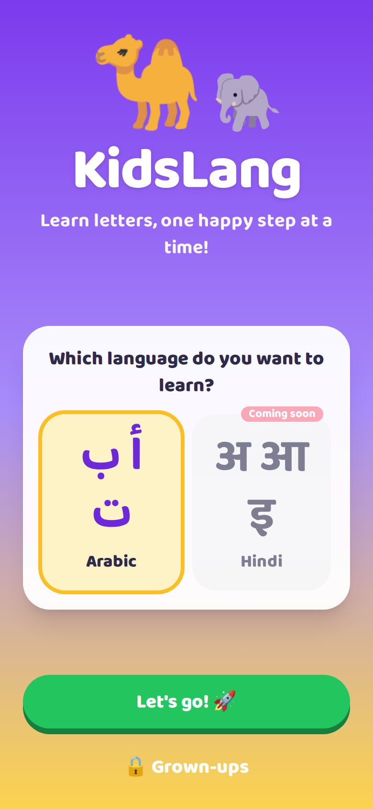

- The camel (Arabic) and elephant (Hindi) mascots. Tap the camel to hear a greeting.
- Language picker: **Arabic** is selectable. **Hindi** is visible but marked *Coming soon*.
- **Let's go!** leads to parent sign-up, or straight to profiles if a parent is already signed in.
  **Grown-ups** leads to sign-in.

## 2. Parent sign-up and parent gate
BRD §14 #2 · FR-01, FR-04

| Sign-up with consent | Gate step 1: hold 3 s | Gate step 2: multiplication |
|---|---|---|
| 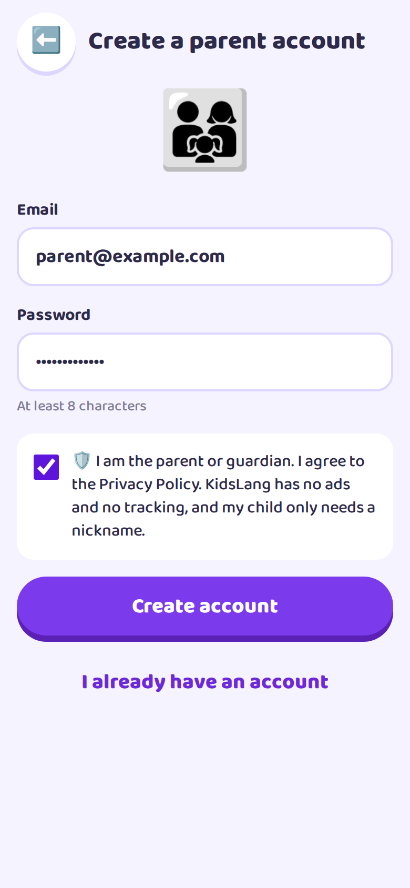 | 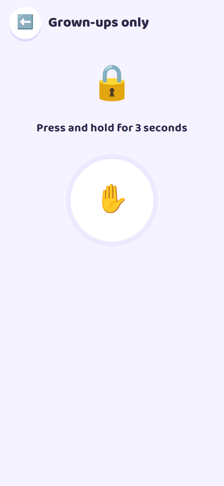 | 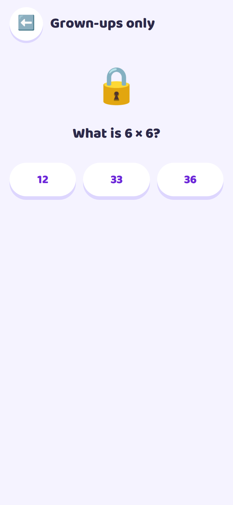 |

- Parents register with an email and a password of 8+ characters. Emails are lower-cased before they're stored.
- A **consent step** is required (COPPA / GDPR-K): no ads, no tracking, and the child only needs a nickname.
- The **parent gate** protects profile creation, settings and the dashboard. The parent holds the button for
  3 seconds, then taps the answer to a multiplication. A passed gate lasts 5 minutes.

## 3. Who's learning? and child profiles
BRD §14 #3 · FR-02, FR-03

| New learner (behind the gate) | Who's learning? | Picture-PIN |
|---|---|---|
| 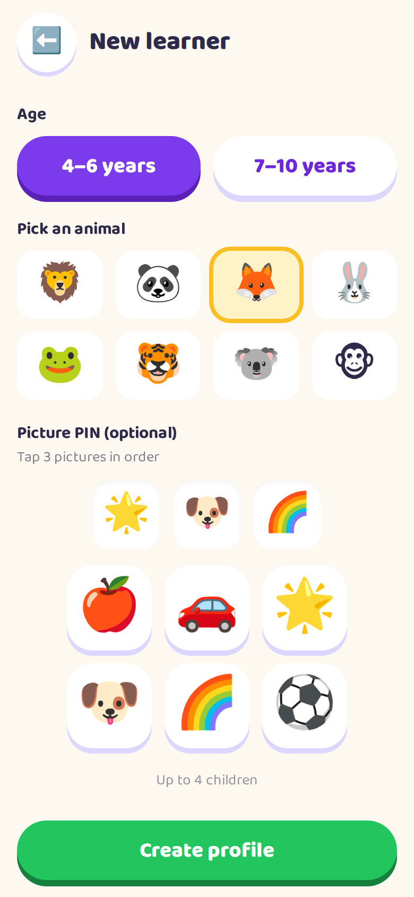 | 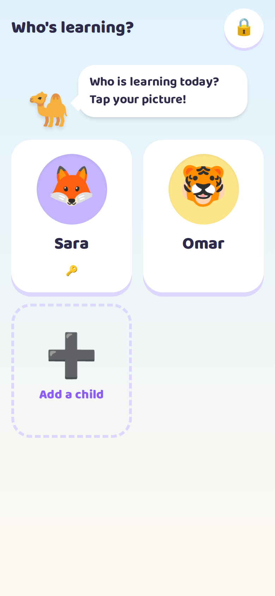 | 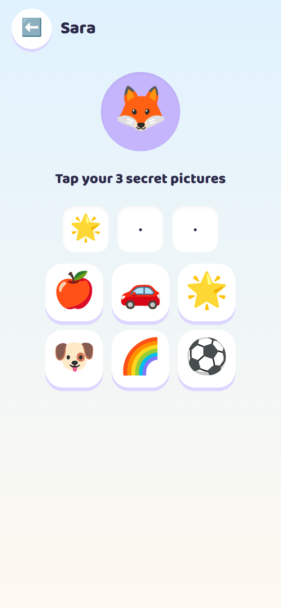 |

- Up to **4 children** per parent. Each child has a nickname, an age band (4–6 / 7–10) and an animal avatar. No email,
  real name or location is collected.
- The **picture-PIN** is optional: the child taps 3 pictures in order, so there's no typing. The 🔑 on Sara's tile shows she has one.
- The 🔒 button (top corner) opens the parent area through the gate.

## 4. Course picker
BRD §14 #4

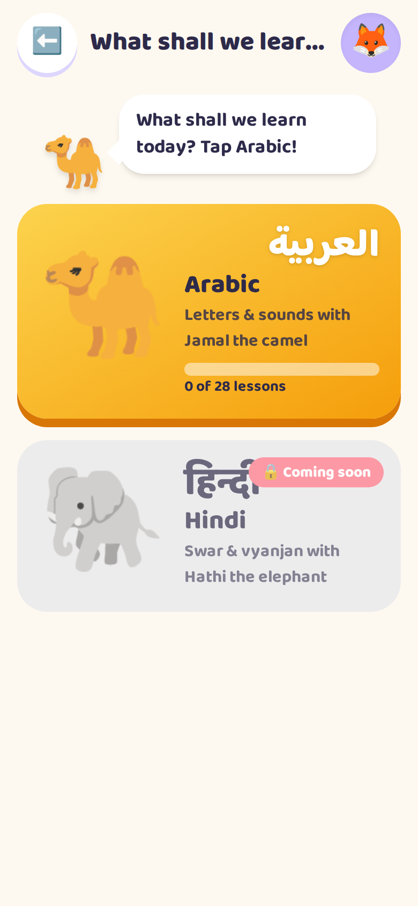

- Big course cards with the mascot and a progress bar ("0 of 28 lessons").
- Hindi is shown as *Coming soon* (Phase 2 of this build).

## 5. Journey map
BRD §14 #5 · FR-10, FR-12, FR-14

| Fresh start | After Unit 1 |
|---|---|
| 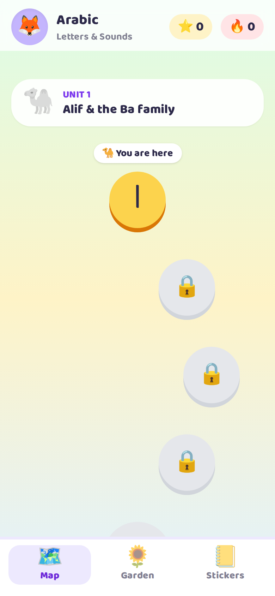 | 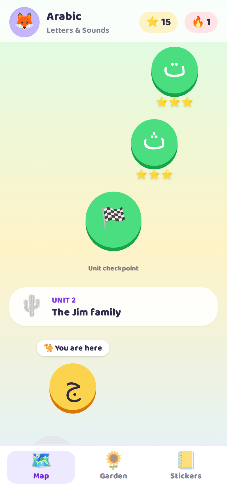 |

- A winding path of **28 letter lessons in 8 units**. Each unit ends in a **Unit checkpoint** 🏁, and the level ends
  with a **Level test** 🏆.
- Node states:
  - **Mastered:** green, with 1–3 stars.
  - **Available / in progress:** glowing yellow, with the mascot's "You are here" bubble.
  - **Locked:** grey, with a 🔒.
- A node opens only when the one before it is mastered. The next unit opens only after its checkpoint.
- The header shows total ⭐ stars and the 🔥 day streak. The bottom nav holds Map, Garden and Stickers.

## 6. Lesson runner
BRD §14 #6 · FR-11, FR-15, FR-18

Every lesson runs **Learn → Play → Check** in order:
- **Learn:** a letter card and tracing.
- **Play:** 5 practice activities.
- **Check:** a 6-question mastery quiz with no hints.

The runner's chrome, seen at the top of every activity screen below:
- **Progress caterpillar 🐛:** one segment per activity.
- **Stage chip:** *Learn*, *Play* or *Check*.
- **Big 🔊 replay button:** replays the spoken instruction and the letter sound.
- **Caption:** every spoken instruction is also shown as text.
- **✖:** returns to the map. The lesson resumes where the child stopped.

## 7. Activity screens
BRD §14 #7 · §6 activity types (data-driven, one renderer per type, validated with Zod)

| A8 Story Card | Learn card | A2 Trace the Letter |
|---|---|---|
| 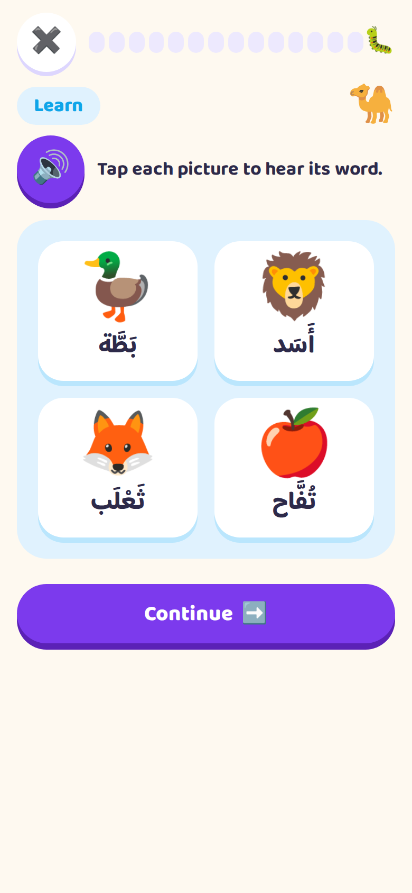 | 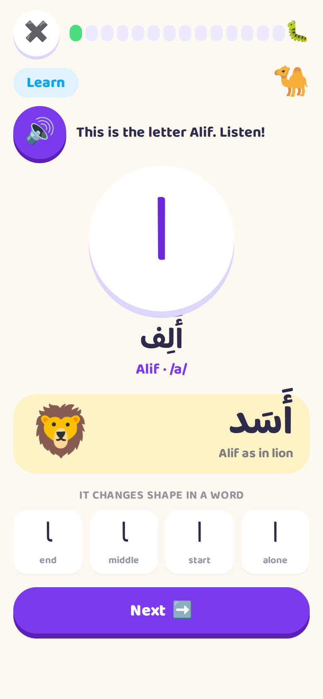 | 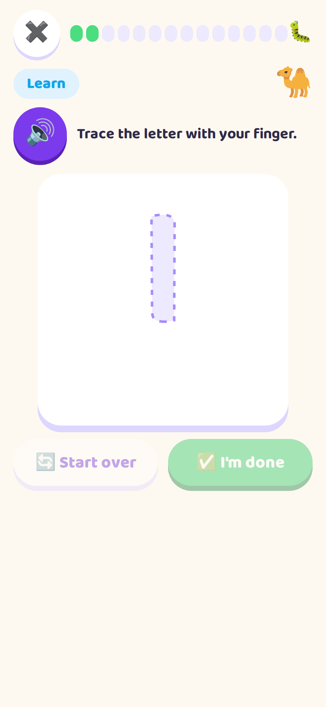 |

- **Story Card:** opens the first lesson of each unit with a scene of every letter that unit will teach (2–4
  items — every unit has that many lessons). Tapping a picture speaks its word; **Continue** moves into the
  first letter's Learn card. Doesn't affect mastery — it's a preview, not a quiz.
- **Learn card:**
  - Shows the letter, its Arabic name and its sound (`/a/`).
  - Gives an example word with a picture (أَسَد = lion 🦁).
  - Shows the letter's **4 position forms** (alone / start / middle / end), rendered as real joined shapes.
- **Trace the Letter:** the child follows the dotted guide with a finger. Scoring measures how much of the letter was
  covered and how much ink stayed on it. The Check needs ≥ 70% accuracy.

| A1 Listen & Tap |
|---|
| 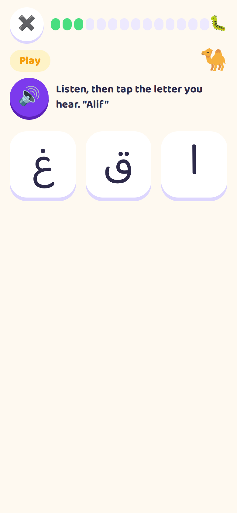 |

- **Listen & Tap:** hear the letter, tap the match. In Play, the answer is highlighted as a hint after two misses.

| A3 Match Pairs | A4 Drag & Drop | A5 Pop the Balloon |
|---|---|---|
| 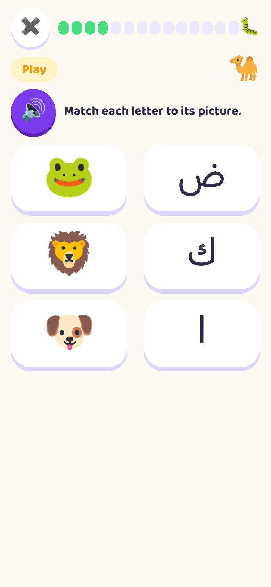 | 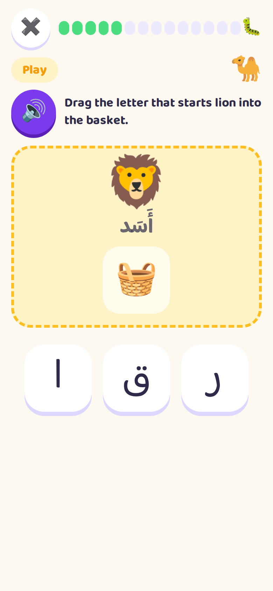 | 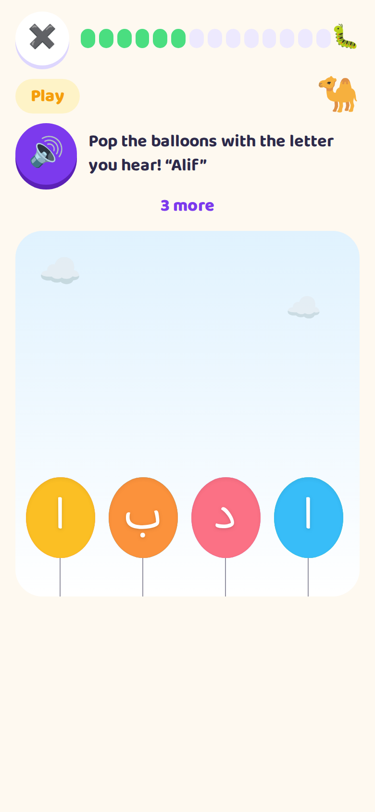 |

- **Match Pairs:** tap a letter, then the picture whose word starts with it.
- **Drag & Drop:** drag the letter that starts the pictured word into the basket (touch drag via dnd-kit).
- **Pop the Balloon:** balloons float up, and the child pops those carrying the letter they hear. Balloons stay still
  when *reduce motion* is on, as in this capture.

| A6 Find the Letter | Check (mastery quiz) |
|---|---|
| 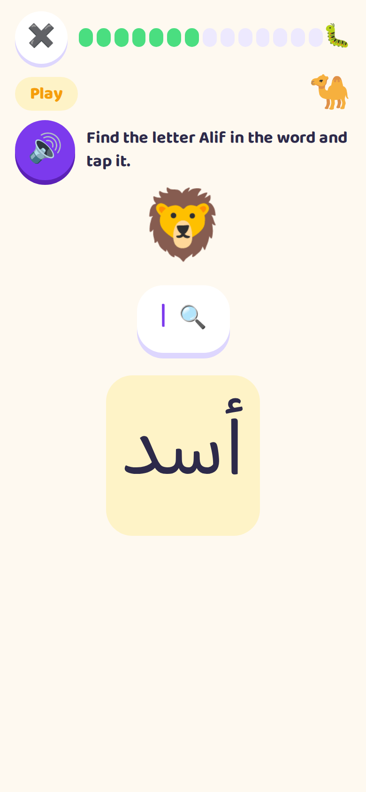 | 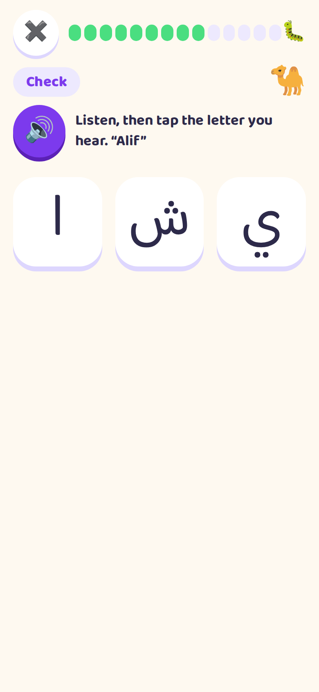 |

- **Find the Letter:** spot the letter inside a real word. The word stays **properly joined** even though every letter is
  its own tap target (zero-width joiners keep the connected forms).
- **Check:** 6 items that mix the new letter with 20–30% review letters, plus one tracing item. The first answer counts,
  and there are no hints. Wrong answers get a gentle response and the quiz moves on. The child never sees "wrong" or
  "failed".

## 8. Reward screen
BRD §14 #8 · FR-20

| Lesson mastered | Unit checkpoint passed |
|---|---|
| 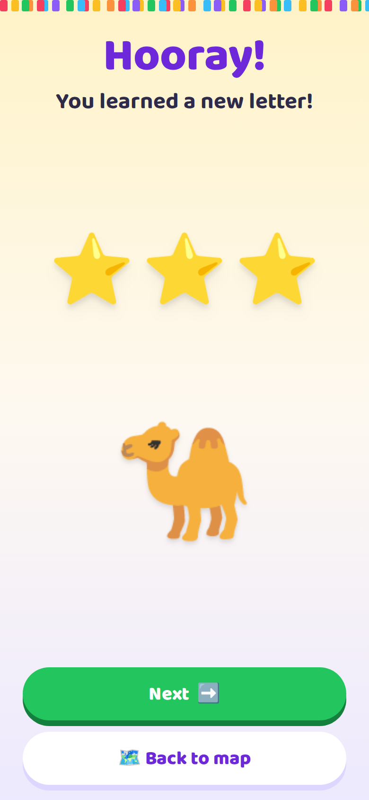 | 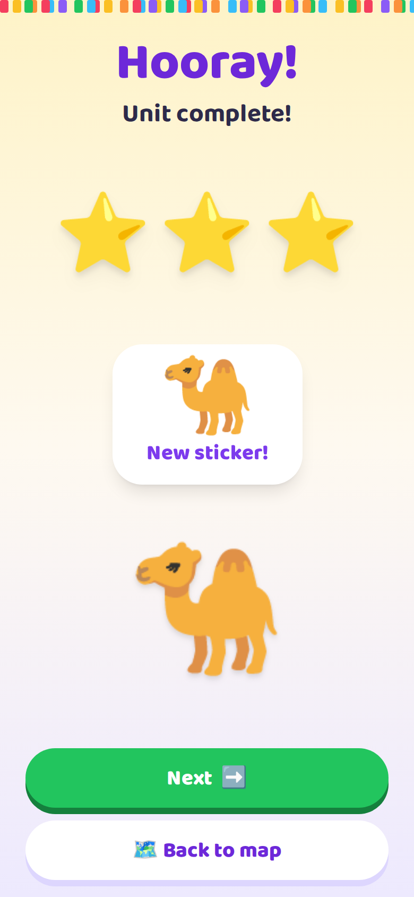 |

- Stars are awarded as 80–89% → 1★, 90–99% → 2★, 100% → 3★, with confetti, a celebrating mascot and a chime.
- Passing a **unit checkpoint** reveals that unit's **sticker**. Passing the level test awards a **trophy**.
- **Next** goes straight to the next lesson. **Back to map** returns to the journey.

## 9. Help Loop
BRD §14 #9 · FR-13

| Help Loop intro | Re-teaching |
|---|---|
| 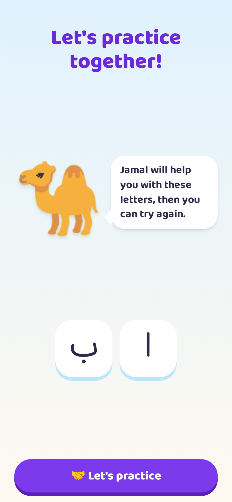 | 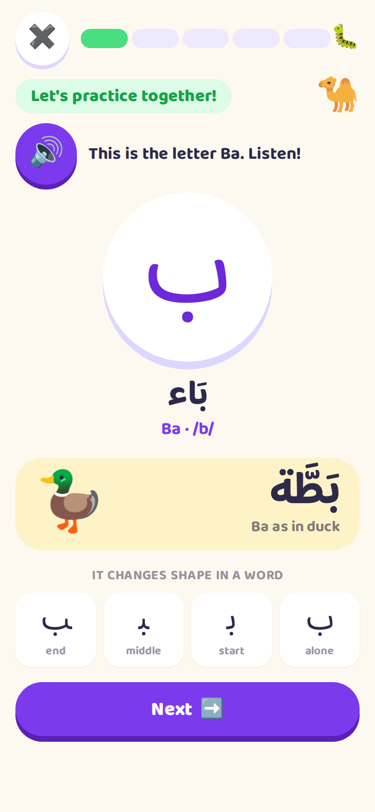 |

If the Check isn't passed, the child is never told they failed. Jamal says **"Let's practice together!"** and shows the
letters that need work. The loop then runs:
1. It re-teaches each missed letter.
2. It gives 2–3 targeted practice activities.
3. It retries the Check with a **newly generated question mix**.

The next lesson stays locked until mastery.

## 10. Practice Garden
BRD §14 #10 · FR-17

| Garden with letters due | Quick review | Garden watered |
|---|---|---|
| 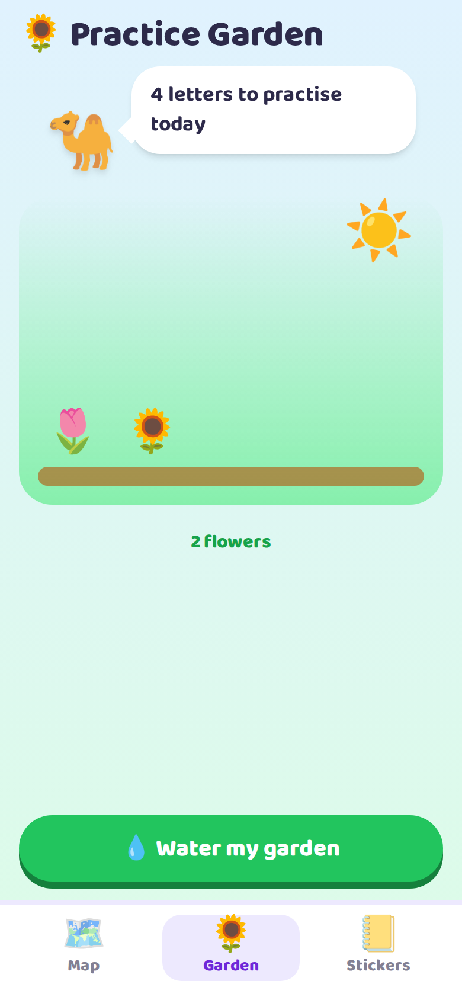 | 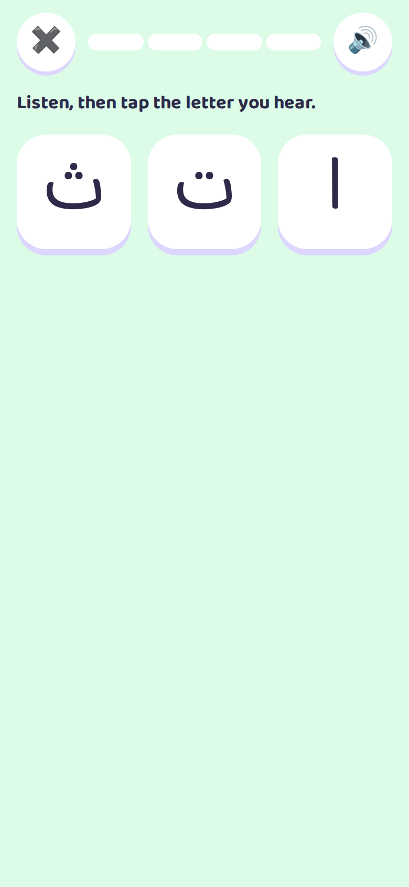 | 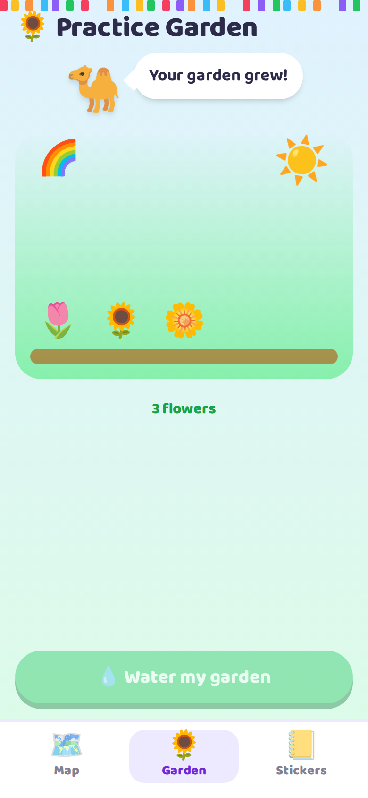 |

- Every learned letter sits in a **Leitner box (1–5)**, reviewed after 1, 2, 4, 7 or 14 days. A correct review moves the
  letter up one box (at most once per day). A miss sends it back to box 1.
- Each day the garden offers a short review of the letters that are due. Finishing it **waters the garden** (🌈), and each
  learned letter grows a flower.
- The walkthrough fast-forwards the clock two days so the letters learned earlier are due.

## 11. Sticker book and avatar
BRD §14 #11 · FR-20, FR-22

| Sticker book | My look (avatar) |
|---|---|
| 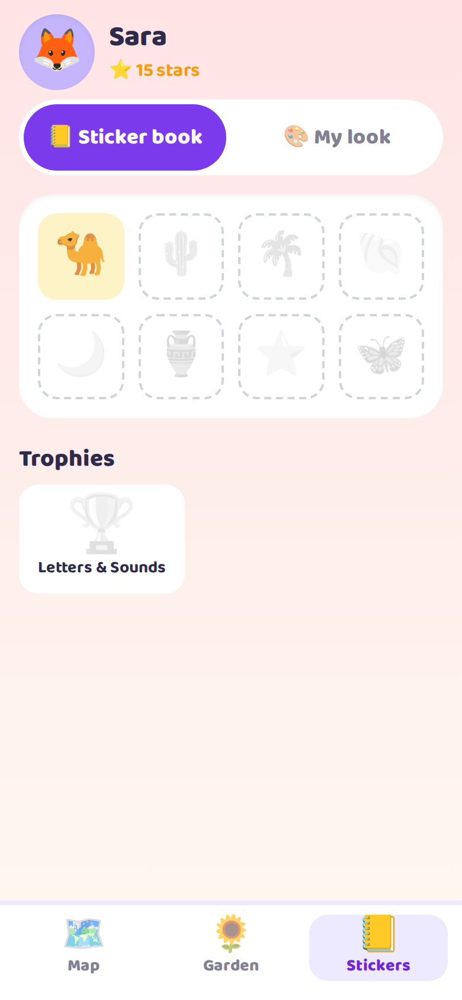 | 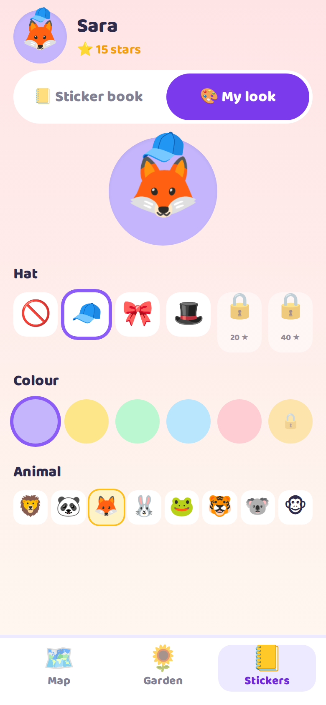 |

- Eight unit stickers (earned: 🐪 Unit 1) and the level trophy.
- **Avatar items unlock with stars:**
  - Hats: 🧢 3★, 🎀 6★, 🎩 10★, 👑 20★, 🎓 40★.
  - Some colours unlock at higher star counts.
  - Any animal can be chosen.

## 12. Parent dashboard
BRD §14 #12 · FR-30 – FR-35, FR-05

| Progress, time, weak letters | Settings |
|---|---|
| 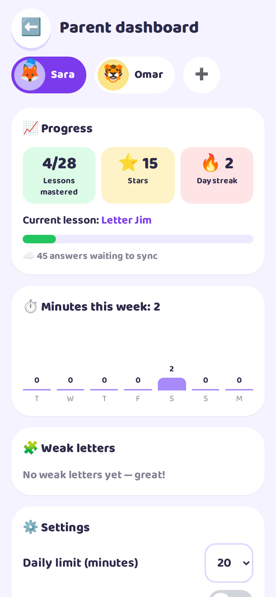 | 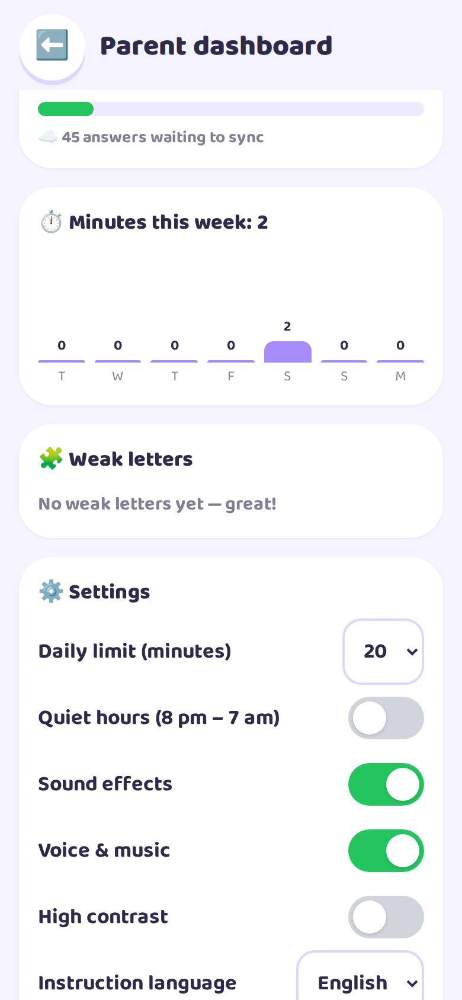 |

- Per child:
  - Lessons mastered, stars, day streak and current lesson.
  - Minutes played per day this week.
  - **Weak letters**, with *Add to today's review*.
  - How many answers are **waiting to sync**. They're queued offline under client-generated IDs.
- Settings:
  - Daily screen-time limit and quiet hours (8 pm – 7 am).
  - Sound effects, voice & music, and high contrast.
  - Instruction language (English / العربية).
- Further down:
  - **Unlock a lesson** (parent override).
  - **Delete profile and all data**. This takes two taps to confirm.

---

## Extras: RTL UI, break time, desktop

| Arabic UI (right-to-left) | Screen-time limit reached | Desktop: centred phone frame |
|---|---|---|
| 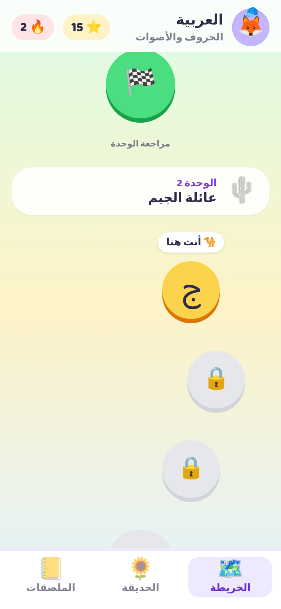 | 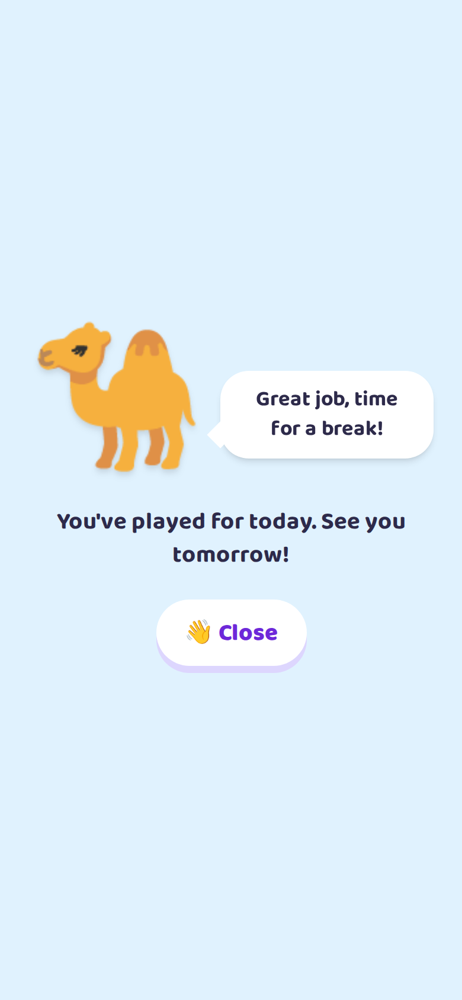 | 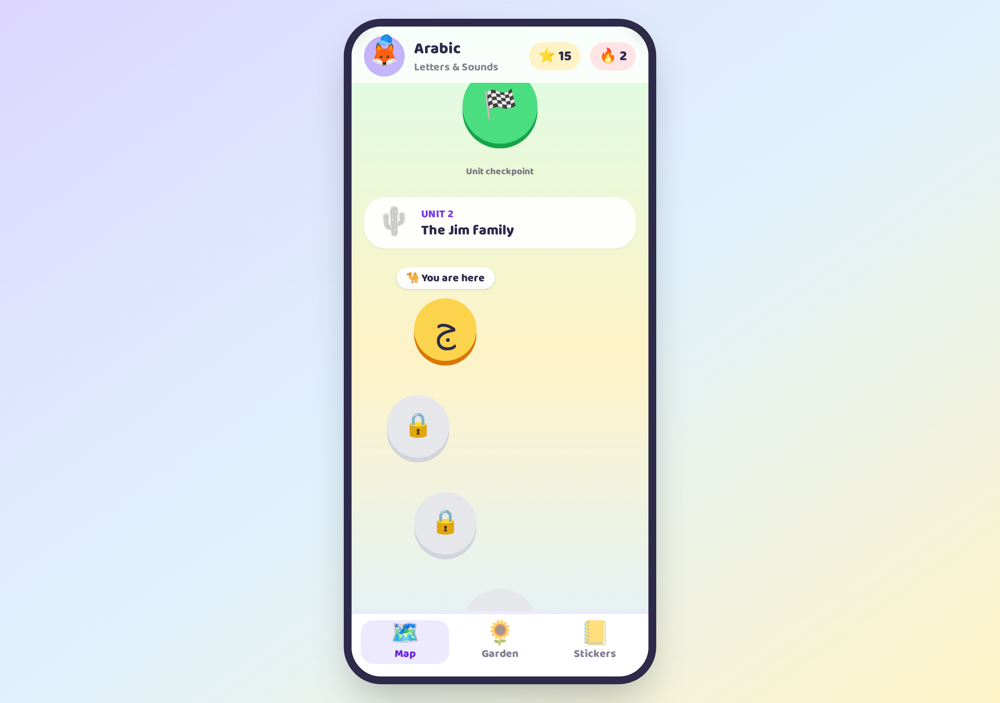 |

- With the instruction language set to Arabic, **the whole interface mirrors** right-to-left: header, path, bottom nav and
  unit banners. Arabic lesson content is always RTL, whatever the UI language.
- When the parent's daily limit is reached, the child sees **"Great job, time for a break!"** instead of lessons.
- On tablets and desktops the app sits in a centred phone frame. On phones it fills the screen, with safe-area insets.

---

## What's real and what's a placeholder

| Area | Status |
|---|---|
| Arabic Level 1 content: 28 letters, 8 units, 8 checkpoints, level test | ✅ Complete (Modern Standard Arabic) |
| Learn → Play → Check, mastery gate, stars, Help Loop, Leitner review | ✅ Implemented, with unit and E2E tests |
| Activities A1–A6 + learn card + A8 Story Card | ✅ Implemented. A7 Build the Word needs multi-letter words, which start at Level 3 — not applicable to the Level 1 letters MVP |
| Audio | ⚠️ Uses the device's text-to-speech voice. **Native-speaker recordings are still needed** (paths are in `items.json`) |
| Pictures & mascots | ⚠️ Emoji placeholders until illustration/animation assets exist |
| Tracing | ⚠️ Scores coverage + accuracy. Stroke **order and direction** scoring (FR-16) still needs per-letter stroke data |
| Offline | ✅ Service worker caches the app and fonts; answers queue locally and flush to the API once online (FR-42) |
| Backend API (`services/api`) | ✅ Auth, profiles, journey, server-side mastery, idempotent attempt sync, review, report, unlock; tests pass on SQLite and PostgreSQL |
| Web ↔ API integration | ✅ The web app calls the real backend when `VITE_API_URL` is set: parent register/login, child profiles (idempotent by id), and quiz submission, with the server able to *upgrade* a locally-missed mastery on sync (FR-12). ⚠️ Sign-in is local-first, so a parent's account doesn't yet follow them to a second device with no local history there |
| Hindi | ⏳ Not started (card shows *Coming soon*) |
